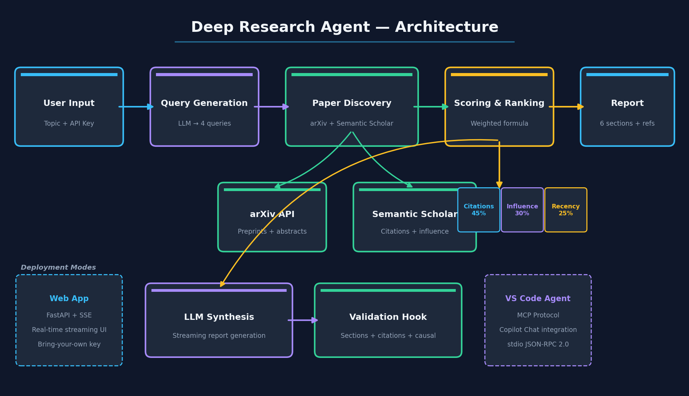

# Deep Research Agent

AI-powered tool that surveys scientific literature — searches arXiv + Semantic Scholar, ranks ~100 papers by importance, and synthesizes a structured, citation-rich research report.



## Features

- **Multi-source search** — arXiv and Semantic Scholar with LLM-generated queries
- **Paper scoring** — weighted ranking by citations (45%), influential citations (30%), recency (25%)
- **6-section report** — research landscape, data, methods, predictions, causation vs. correlation, gaps
- **Real-time streaming** — live progress and report rendering in the web UI
- **Validation hook** — checks section completeness, citation density, and causal language
- **Dual deployment** — web app (bring-your-own key) or VS Code agent (MCP + Copilot Chat)

## Quick Start

### Web App

```bash
pip install -r requirements.txt
uvicorn web_app.server:app --reload
# Open http://localhost:8000
```

Enter a topic, select provider (OpenAI/Anthropic), paste your API key, and click **Start Research**.

### VS Code Agent

1. Open in VS Code 1.99+ with GitHub Copilot Chat
2. Switch to the **deep-researcher** agent
3. Type your research topic

### Semantic Scholar API Key (optional)

Rate limit is 1 req/s without a key, 10 req/s with one. Get a free key at [semanticscholar.org/product/api](https://www.semanticscholar.org/product/api).

```bash
# .env (gitignored)
SEMANTIC_SCHOLAR_API_KEY=your_key_here
```

## Paper Scoring

$$\text{score} = 0.45 \cdot \frac{\log(1 + c)}{\hat{c}} + 0.30 \cdot \frac{\log(1 + c_{\inf})}{\hat{c}_{\inf}} + 0.25 \cdot \max\!\left(0,\ 1 - \frac{\text{age}}{20}\right)$$

- $c$ = citation count; $\hat{c}$ = batch max (log-normalized)
- $c_{\inf}$ = influential citations; $\hat{c}_{\inf}$ = batch max
- age = years since publication (>20 yr scores 0)

## Project Structure

```
web_app/
  server.py          # FastAPI + SSE streaming
  agent.py           # Research pipeline orchestration
  providers.py       # OpenAI / Anthropic abstraction
  static/index.html  # Single-page UI
tools/
  arxiv_server.py            # arXiv MCP server
  semantic_scholar_server.py # Semantic Scholar MCP server
.github/
  agents/deep-researcher.agent.md  # VS Code agent definition
  hooks/validate_report.py         # Post-write quality checks
  skills/paper-analysis/           # Paper analysis skill + scripts
```

## Development

```bash
pytest tests/ -v
```

To add a provider, implement `_<name>_stream()` in `web_app/providers.py` and add it to `stream_completion`.

## Requirements

Python 3.11+ — see `requirements.txt` for dependencies.
